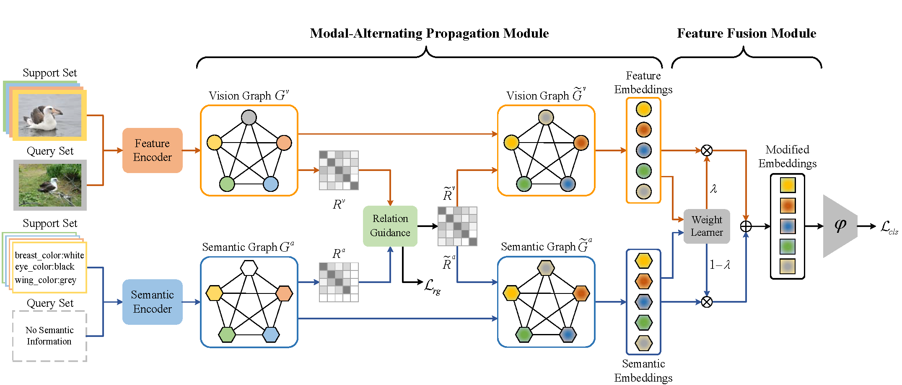

# MAP-Net

pytorch implementation of the paper ["Information Symmetry Matters: A Modal-Alternating Propagation Network for Few-Shot Learning"](https://ieeexplore.ieee.org/abstract/document/9687125/)



# How to run
```
# train the model
python train.py --dataset cub --backbone conv4 --nExemplars 1 --alpha 0.2 --miu 1 --drop_rate 0.5 --model_name map

python train.py --dataset sun --backbone conv4 --nExemplars 5 --alpha 0.3 --miu 0.4 --drop_rate 0.5 --model_name map

# eval with the trained model
python test.py --dataset cub --backbone conv4 --nExemplars 1 --alpha 0.2 --miu 1 --drop_rate 0.5 --model_name map

python test.py --dataset cub --backbone conv4 --nExemplars 5 --alpha 0.3 --miu 0.4 --drop_rate 0.5 --model_name map
```

# Acknowledge

